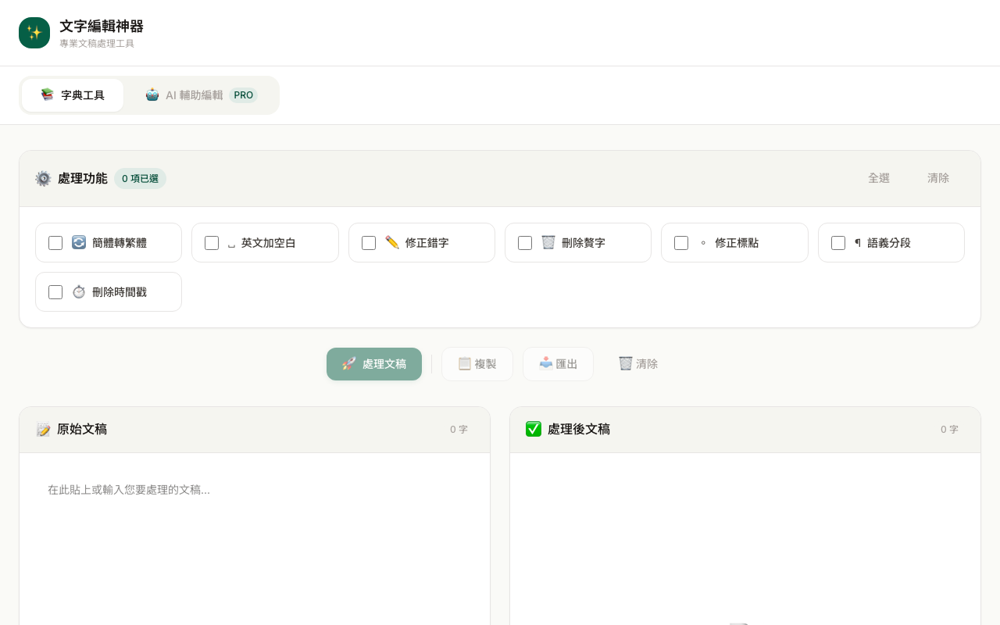

# 文字編輯神器 使用說明

## 這是什麼？

專業文稿編輯工具，提供簡繁轉換、全形半形轉換、標點符號統一、文字比對（diff）等功能。適合編輯、翻譯、校對等需要大量文字處理的工作者。

## 使用方式

1. 開啟工具頁面
2. 在左側編輯區貼上或輸入文稿內容
3. 從工具列選擇需要的功能：
   - **簡→繁**：將簡體中文轉為繁體（使用 OpenCC 引擎，含台灣用語轉換）
   - **繁→簡**：將繁體中文轉為簡體
   - **全→半**：全形符號轉半形
   - **半→全**：半形符號轉全形
   - **標點統一**：統一中文標點風格
4. 處理結果會即時顯示在右側預覽區
5. 點擊「複製」或「匯出」取得處理後的文稿

## 功能特色

- **OpenCC 繁簡轉換**：不只換字，還處理台灣/中國用語差異（如「軟體↔软件」「記憶體↔内存」）
- **文字比對（Diff）**：逐字比對修改前後差異，標示新增、刪除、修改處
- **diff 統計**：準確顯示新增/刪除/修改的字數
- **即時預覽**：所有操作即時反映，不需等待
- **深色/淺色主題**：支援主題切換，長時間工作不傷眼

## 注意事項

- 繁簡轉換使用 OpenCC `cn→twp` 基底加上 165 條專業術語覆蓋層
- 大型文稿（超過 10 萬字）處理可能需要數秒
- 瀏覽器內完成所有處理，文稿不會上傳到任何伺服器
